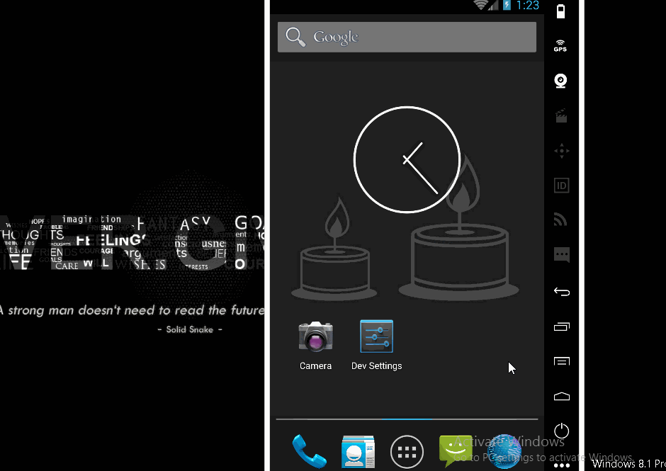

# NewsFeedProject
An small demo app to complete the project 8. See the Tutorial on our cliffnotes for a step-by-step tutorial.

Time spent: 6 hours implementation (included searching) in total
 - 07/23: 6 hours

Implement link: https://github.com/TienVNguyen/NewsFeedProject

 - Layout:
 * [x] Main Screen: App contains a main screen which displays multiple news stories
 * [x] List Item Contents: Each list item on the main screen displays relevant text and information about the story, including the title and author.
 * [x] Layout Best Practices: The code adheres to all of the following best practices
 * [x] + Text sizes are defined in sp
 * [x] + Lengths are defined in dp
 * [x] + Padding and margin is used appropriately, such that the views are not crammed up against each other.

 - Functionality:
 * [x] Main Screen Updates: The news stories display on the main screen update as new stories are fetched.
 * [x] Errors: The code runs without errors.
 * [x] Story Intents: clicking on a story opens the story in the user’s browser.
 * [x] Api Query: App queries the content.guardianapis.com api to fetch news stories related to the topic chosen by the student, using either the ‘test’ api key or the student’s key.
 * [x] External Libraries and Packages: The intent of this project is to give you practice writing raw Java code using the necessary classes provided by the Android framework; therefore, the use of external libraries for the core functionality will not be permitted to complete this project.

 - Code Readability:
 * [x] Readability: Code is easily readable such that a fellow programmer can understand the purpose of the app.
 * [x] Naming conventions : All variables, methods, and resource IDs are descriptively named such that another developer reading the code can easily understand their function.
 * [x] Formatting : The code is properly formatted i.e. there are no unnecessary blank lines; there are no unused variables or methods; there is no commented out code. The code also has proper indentation when defining variables and methods.
 

Notes:

Walkthrough of all functionalities:

